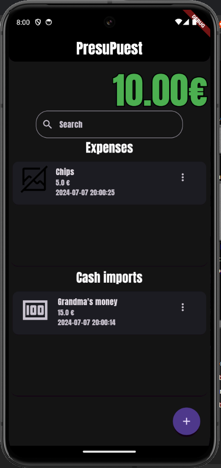
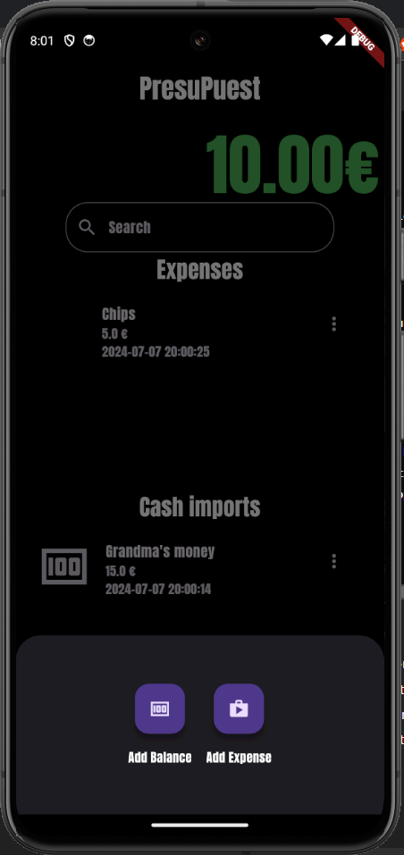
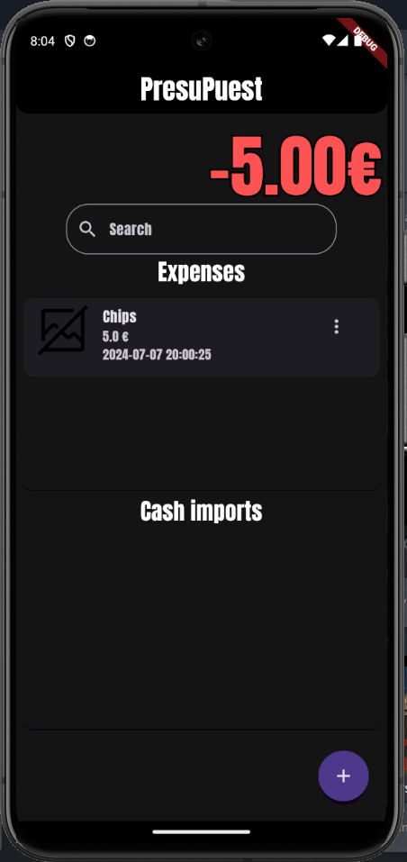

 

  

<h1 align="center">PresuPuest</h1>

<h3 align="center">An Expense Tracker built with Flutter for iOS and Android</h3>

Keep track of you in-hand cash with PresuPuest, a simple yet usefull expense tracking aplication.

Keep track of all of your expenses and monetary gains in one place to better manage that sweet cash.

---

---
## Contributing?

- Feel free to open up any issues or ask for features in the issues tab!
- If you want to contribute directly make sure to fork the repo and submit a pull request for me to review.

---
## Contact

Feel free to contact me [@ThePangel_](https://twitter.com/thepangel_) on Twitter/X or DM me on discord @thepangel